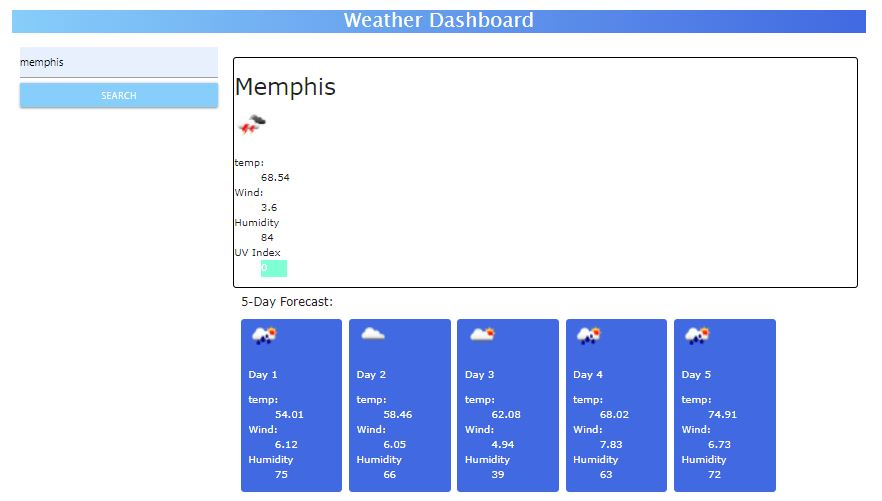

# Weather-Dashboard

A simple weather dashboard that displays current conditions and a 5 day forecast based on user location input.

# Description

This web application uses the Open Weather API to display current weather conditions and a 5 day forecast for a user specified city. Information displayed includes current temperature, wind speed, humidity, and UV index, as well as 5 day forecast information.

# User Story

AS A traveler
I WANT to see the weather outlook for multiple cities
SO THAT I can plan a trip accordingly

# Acceptance Criteria

This project meets the given Acceptance Criteria:

GIVEN a weather dashboard with form inputs
WHEN I search for a city
THEN I am presented with current and future conditions for that city and that city is added to the search history
WHEN I view current weather conditions for that city
THEN I am presented with the city name, the date, an icon representation of weather conditions, the temperature, the humidity, the wind speed, and the UV index
WHEN I view the UV index
THEN I am presented with a color that indicates whether the conditions are favorable, moderate, or severe
WHEN I view future weather conditions for that city
THEN I am presented with a 5-day forecast that displays the date, an icon representation of weather conditions, the temperature, the wind speed, and the humidity
WHEN I click on a city in the search history
THEN I am again presented with current and future conditions for that city

# Useage

On load, the user is with a blank weather dashboard, and a search input to enter a city.

When the user enters a city, the current conditions are displayed in the main content area, and the 5 day forcast is displayed below. The Temperature, Wind Speed, Humidity, and VU Index are displayed in the current conditions, along with a weather conditions icon. For the 5 day forecast, Temperature, Wind Speed, Humidity and the weather Icon are displayed.

